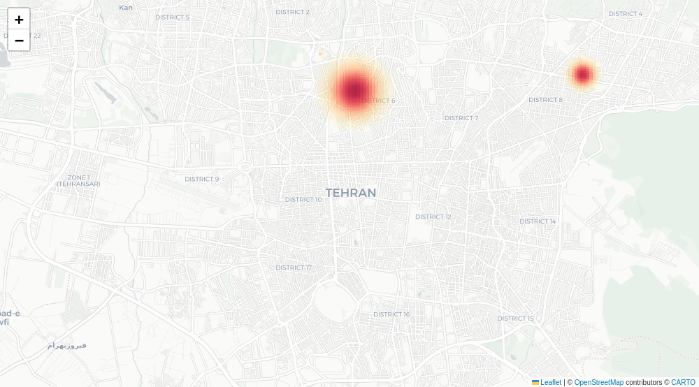

# City Life Heatmap

A personal familiarity map: click places you've lived, frequented, traveled to, visited, or briefly stopped by, and get back a heatmap where each spot glows with a radius and intensity scaled to how well you actually know it.



*(Demo image generated from the synthetic `data/locations.example.csv` — no real personal data is included in this repo.)*

**[→ Open the web version](https://YOUR-USERNAME.github.io/life-heatmap/)** — no install, nothing to sign up for, and your places never leave your browser.

## How it works

Instead of a generic "distance decay" heatmap, each point's glow radius and color intensity come from a small model of how spatial familiarity actually builds up: fast at first, then leveling off with more exposure (a saturating exponential — the shape spatial-cognition research uses for how people build a mental map of a place), with different ceilings depending on *how* you were exposed to it.

| Category | Radius range | Saturates around | What it's for |
|---|---|---|---|
| **Lived** | 250m → 1200m | ~1 year | You resided there — familiarity grows to a walkable "pedshed" around home. |
| **Frequented** | 150m → 700m | ~10 months | A routine anchor point over an extended period without living there — school, a job, a language institute. |
| **Traveled** | 150m → 500m | ~2 days | A short trip outside your routine (days to weeks) — you cover real ground sightseeing, but it's temporary. |
| **Visited** | 80m → 350m | ~6 months | Repeat point-to-point trips to one destination — a friend's place, a regular café. |
| **Guest** | 40m → 120m | ~6 hours | A one-off visit of a few hours — familiarity never leaves the venue. |

These ranges are an informed heuristic (grounded in pedestrian-catchment/"pedshed" urban planning standards and spatial-knowledge-acquisition research), not a measured constant — tune them freely in **`docs/model_params.json`**.

That one file is the model. Both the web app and the Python code read it, so changing a radius there changes both and they can't drift apart. (It lives inside `docs/` because that's the folder GitHub Pages serves as the website root — the browser can only fetch files from in there.)

## Three ways to use it

| | Runs where | Your data lives | Good for |
|---|---|---|---|
| **Web app** (`docs/`) | Any browser, nothing installed | That browser's local storage | Everyday use, and sharing the link with people |
| **Flask collector** (`app.py`) | Your machine, `localhost:5000` | `data/locations.csv` | Wanting your places in a real file you can edit by hand |
| **CLI** (`heatmap.py`) | Your machine, terminal | Whatever CSV you point it at | Scripting, batch runs, tweaking the rendering |

All three produce the same map, because they share the same model.

## The web app

Open the link above, or run it locally:

```bash
cd docs
python3 -m http.server
```

then open <http://localhost:8000>. (Opening `docs/index.html` straight off disk won't work — browsers refuse to let a `file://` page read `model_params.json`. Any static file server is fine.)

The map opens on Tehran; pan to your own city, or type it in the search box at the top right. Click anywhere to add a place, pick a category and how long you were there, and a dashed circle previews the exact glow radius before you save. **Generate Heatmap** renders the glow over the map, and **Download shareable image** produces a single high-resolution PNG with a caption card, sized for posting.

**Export** saves your places as a CSV using the same columns as `data/locations.csv` — so a file exported from the browser feeds straight into the Python CLI, and vice versa.

### Publishing your own copy to GitHub Pages

The web app is plain HTML, CSS and JavaScript — no build step, no server. To put your fork online for free:

1. Push this repo to GitHub (it must be a public repo, on a free account).
2. Go to **Settings → Pages**.
3. Under "Build and deployment", set **Source** to *Deploy from a branch*, then pick branch `main` and folder **`/docs`**. Save.
4. Wait about a minute. Your site appears at `https://YOUR-USERNAME.github.io/life-heatmap/`.

Every later `git push` redeploys it. Update the link at the top of this README to your own URL.

Nothing is running on GitHub's side — it just hands the files to whoever visits, and the map is built in their browser. That's also why there's no shared database: each visitor's places are stored only in their own browser, invisible to you and to everyone else.

## The Flask collector and the CLI

Requires **Python 3.10+**. Check with `python3 --version` (Windows: `python --version`).

- **Windows**: get it from [python.org/downloads](https://www.python.org/downloads/) — tick **"Add python.exe to PATH"** on the installer's first screen, easy to miss and needed for the commands below to work.
- **macOS**: get it from [python.org/downloads](https://www.python.org/downloads/) (the built-in `python` is an old Python 2 — this needs 3.10+, hence `python3` below).
- **Linux**: usually already installed; otherwise `sudo apt install python3 python3-venv` (Ubuntu/Debian) or your distro's equivalent.

No Git? On this repo's GitHub page, **Code → Download ZIP**, unzip it, then `cd` into that folder instead of `git clone`ing.

```bash
git clone <this-repo-url>
cd life-heatmap
```

### Install and run

**Linux / macOS**

```bash
python3 -m venv .venv
./.venv/bin/pip install -r requirements.txt
./.venv/bin/python app.py
```

**Windows (PowerShell or cmd)**

```powershell
py -m venv .venv
.venv\Scripts\pip install -r requirements.txt
.venv\Scripts\python app.py
```

(If `py` isn't found, use `python` instead — depends on how Python was installed.)

The middle line downloads this project's dependencies into a private folder (`.venv`) inside the project — it doesn't touch anything else on your system, and re-running it is safe. It only needs to be run once; after that, just re-run the last line each time.

Once it's running, open **http://127.0.0.1:5000**. Unlike the web app, this version auto-fills a street address for each point (via OpenStreetMap Nominatim) and writes to `data/locations.csv`. To stop it, press `Ctrl+C` in the terminal.

### Command line only

```bash
./.venv/bin/python heatmap.py --input data/locations.csv --output output/life_heatmap.html
```

On Windows, use `.venv\Scripts\python` instead of `./.venv/bin/python`.

Add `--skip-geocode` if every row already has `lat`/`lon` filled in (otherwise addresses are resolved via Nominatim and the coordinates are cached back into the CSV). Renders both a standalone interactive HTML map and the heat overlay PNG.

## Your data stays yours

- **Web app**: places are held in your browser's local storage and nothing is ever uploaded. The page makes exactly two kinds of outbound request: basemap tiles from Esri, and — only when you press **Go** in the search box — one city lookup. Adding a place sends nothing.
- **Python versions**: `data/locations.csv` (your real places) and `output/` are both **git-ignored**. The only location data tracked in this repo is `data/locations.example.csv`, a small synthetic dataset used for the demo image.

## Project structure

```
docs/                       The web app — this folder is what GitHub Pages serves
  index.html                Page and styles
  app.js                    The model, the map UI, and the PNG export, in the browser
  model_params.json         Shared model constants, read by the browser AND by Python
  demo_heatmap.png          README screenshot
heatmap.py                  Core model: familiarity math, density grid, rendering, CLI
app.py                      Flask backend for the local collector
templates/index.html        Click-to-add map UI for the Flask version (Leaflet)
data/locations.example.csv  Synthetic demo dataset (tracked)
data/locations.csv          Your real places (git-ignored, created on first save)
output/                     Generated heatmaps (git-ignored)
.tile_cache/                Cached basemap tiles for the CLI's share image (git-ignored)
```

## Using this for another city

Nothing in the model is city-specific. The web app opens wherever you last left it; `default_center` in `docs/model_params.json` sets where a first-time visitor starts. Rendered output — the heat grid, the map view, the shareable image — is always framed around your own points, wherever in the world they are.

## Requirements

For the web app: a browser. For the Python versions: Python 3.10+ and the packages in `requirements.txt` (Flask, pandas, numpy, folium, matplotlib, geopy, requests, Pillow).

## License

MIT — see [LICENSE](LICENSE).
